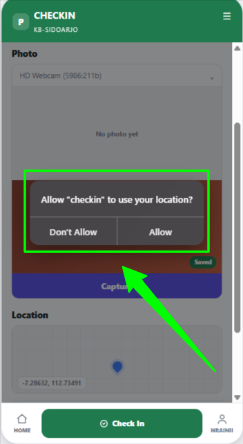

# Step out

## SO.F1 - User redirect to login page

* Given user visit `/checkin/create` url without signin
* Then user redirected to `Sign In` page

<figure><figcaption></figcaption></figure>

## SO.F2 - See Button Checkin&#x20;

* Given I already logged in&#x20;
* and I on the page `/checkin`
* and I don't have the check-in data yet

<figure><figcaption></figcaption></figure>

* Then I will see the check-in button before the step out button.

<figure><figcaption></figcaption></figure>

## SO.F3 - Displaying a pop-up to request permission

* Given I already logged in&#x20;
* And I on the page `/checkin`
* And the camera permission status is Asking
* and I have the check-in data for the date corresponding to the step out date.
* When I click button step out&#x20;

<figure><figcaption></figcaption></figure>

* Then the system displays the native browser permission prompt for the camera

<figure><figcaption></figcaption></figure>

* When I click \<permission choice> on the prompt&#x20;

| Permission choice | Status\_Permission | Respon                        |
| ----------------- | ------------------ | ----------------------------- |
| Allow             | Allow              | Continue to next validation   |
| Don't Allow       | Blocked            | Camera access is blocked      |
| Dismiss           | Asking             | Re-validate permission status |

*   Then the camera permission status becomes \<status\_permission>

    * UI Status\_Permission Blocked

    <figure><figcaption></figcaption></figure>

    * UI Status\_Permission Asking

    <figure><figcaption></figcaption></figure>

## SO.F4 - Display a text "camera permission blocked"

* Given I already logged in&#x20;
* And I on the page `/checkin`
* And the camera permission status is Blocked
* and I have the checkin data for the date corresponding to the step out date.
* When I click button step out&#x20;

<figure><figcaption></figcaption></figure>

* Then I can view error message "Camera access is blocked"&#x20;

<figure><figcaption></figcaption></figure>

## SO.F5 - Displaying a pop-up to request permission

* Given I already logged in&#x20;
* And I on the page `/checkin`
* And the location permission status is asking
* and I have the checkin data for the date corresponding to the step out date.
* When I click button step out&#x20;

<figure><figcaption></figcaption></figure>

* Then the system displays the native browser permission prompt for the location&#x20;

<figure><figcaption></figcaption></figure>

* When I click permission \<Permission choice>

| Permission choice | Status\_Permission | Respon                        |
| ----------------- | ------------------ | ----------------------------- |
| Allow             | Allow              | Continue to next validation   |
| Don't Allow       | Blocked            | Location access is blocked    |
| Dismiss           | Asking             | Re-validate permission status |

*   Then the location permission status become \<status\_permission>

    * UI Status\_Permission Blocked
    *

        <figure><figcaption></figcaption></figure>
    * UI Status\_Permission Asking

    <figure><figcaption></figcaption></figure>

## SO.F6 - Display a text "Location access is blocked"

* Given I already logged in&#x20;
* And I on the page `/checkin`
* And the location permission status is blocked
* and I have the check-in data for the date corresponding to the step out date.
* When I click button step out&#x20;

<figure><figcaption></figcaption></figure>

* Then I can view notification "Location access is blocked"

<figure><figcaption></figcaption></figure>

SO.F7
&#x20;\- Photo not captured.
&#x20;Please take a photo
&#x20;before continuing
-----------------------

* Given I already logged in&#x20;
* And I on the page `/checkin`
* and I have the check-in data for the date corresponding to the step out date.
* I have granted camera access permission
* When I click button step out&#x20;

<figure><figcaption></figcaption></figure>

* And I click submit button without take any photos

<figure><figcaption></figcaption></figure>

<figure><figcaption></figcaption></figure>

* Then I can view notifications "photo not capture. please take a photo before continuing"

<figure><figcaption></figcaption></figure>

SO.F8
&#x20;\- Location not found.
&#x20;Make sure GPS & internet are turned on, then try again
------------------------------------------------------------

* Given I already logged in&#x20;
* And I on the page `/checkin`
* and I have granted access permission for the camera
* and I did not grant GPS access permission
* and I have the check-in data for the date corresponding to the step out date.
* When I click button step out

<figure><figcaption></figcaption></figure>

* And I click capture&#x20;

<figure><figcaption></figcaption></figure>

* And I type Ke bank untuk keperluan kantor into column notes

<figure><figcaption></figcaption></figure>

* And I click submit&#x20;

<figure><figcaption></figcaption></figure>

* Then I can view notification "Location not found. Make sure GPS & internet are turned on, then try again"

<figure><figcaption></figcaption></figure>

## SO.S1 - Step Out success, redirect to feed page

* Given I already logged in&#x20;
* And I on the page `/checkin`
* and I have granted access permission for the camera
* and I have granted access GPS access permission
* and my location has been detected
* and I have the check-in data for the date corresponding to the step out date.
* When I click button step out&#x20;

<figure><figcaption></figcaption></figure>

* And I click capture&#x20;

<figure><figcaption></figcaption></figure>

* And I type Ke bank untuk keperluan kantor into column notes

<figure><figcaption></figcaption></figure>

* And I  click submit&#x20;

<figure><figcaption></figcaption></figure>

* Then I can redirect to feedpage to see step out data&#x20;


Note : Untuk tampilan feed absensi mengikuti tampilan app saat ini. _yang dirubah hanya tombol bawah._&#x20;


<figure><figcaption></figcaption></figure>

* Then, the step out duration will reduce working hours.
